Word Count: 5956

```{=latex}
\epigraph{No democracy can afford market failure in this sector.}{--- Jürgen Habermas, \textit(2010)}
```


# Introduction

Classical models of political accountability are based on the assumption
of full, or at least sufficiently rich, information [@downs1957; @fiorina1978; @ashworth2017]. Voters, however, do not perceive politics
directly, but rather through the mediation of the media [@zaller1992; @zaller1999; @iyengar2010; @mccombs1972]. I argue that the
quality of the media environment feeds back into the quality of the
information available to voters and thus makes accountability a function
of media quality [@snyder2010; @stromberg2004a]. Changes in
the media environment may therefore constitute part of the explanation
for democratic erosion as well as rising political polarization over
time [@prior2007; @lelkes2017].
Whereas the traditional accountability literature primarily emphasizes the availability of political information to voters [@ashworth2012; @stromberg2015],
the quality of that information has received comparatively less attention and has only recently become central to debates on fake news and misinformation [@allcott2017].
With this paper, I do not contribute to the debate on false information; rather, I
define media quality as partisan bias in news coverage [@gentzkow2010].


The quality of information is especially important in the period before
an election, when voters make their electoral decisions. In line with @gelman1993 , I argue that the campaign period is a time of
heightened political intensity [@lazarsfeld2021; @campbell1960; @zaller1992] in which, on the one hand, voters
have a particularly strong demand for political information that aligns
with their prior political views [@stroud2011]. At the same time,
election campaigns generate a particularly high supply of political
information [@iyengar2000] produced by parties and political
elites, which is then taken up by the media [@druckman2013]. Together, these dynamics cause the quality of media
coverage to decline during campaign periods, conditional on the level of
political intensity.


For this reason, this paper asks *what effect political competition intensity has on media coverage*, focusing on the United States because of its pronounced and relatively stable media market in one of the world's oldest democracies [@snyder2010; @petrova2011]. Adopting a historical political economy perspective, I examine a period spanning 100 years of U.S. history. This long time horizon allows me to identify a sufficient number of special elections, which I use as exogenous shocks to the media agenda in order to identify causal effects [@mccombs1972].


This study makes several contributions. First, to the best of my knowledge, it is the first study to systematically compile historical data on special elections. Second, I show the causal effect of campaign intensity on media behavior, examining both the number of political news articles and, in a second step, media quality as measured by partisan slant. The paper thus contributes to the literature on media quality and journalistic norms in historical perspective. In a broader context, it also contributes to the understanding of democratic backsliding and political polarization.

This study proceeds as follows. I review existing theories on the effect of political intensity on domestic media pluralism, identify several political-economic micro-mechanisms, and derive three hypotheses. I test these hypotheses using descriptive statistics, event-study plots, and stacked difference-in-differences models. I show that while special election campaigns do not affect the number of political articles published, they have a positive effect on the partisan slant of newspaper coverage. Furthermore, I find no evidence for a time-conditional effect of special election campaigns. In robustness tests, however, I show that the slant effect is not robust to more demanding specifications such as a donut-difference-in-differences design. Finally, I discuss the results, highlight limitations, and outline directions for future research.

# Theory

## Media, Function, and Pluralism
Media report selectively and, in doing so, structure both public opinion
and the political agenda. From this perspective, the media are not
merely transmitters, but political institutions [@cook2005] whose
organizational forms and market logics vary systematically [@baumgartner2009]. In their comparative analysis of media systems, @hallin2004 identify differences along the dimensions of
political parallelism, journalistic professionalism, state intervention,
and market structures. In systems with high political parallelism,
pluralism is often organized through differentiation across outlets,
while a more coherent line tends to dominate within individual media
organizations; in more professionalized or public-service-oriented
environments, pluralism is more likely to be institutionalized within
individual media outlets [@hallin2004; @blumler1995; @chadwick2017].


<!-- Pluralismus -->
The political economy literature points to a trade-off between internal
pluralism and pluralism across media outlets [@mullainathan; @gentzkow2010]. In media markets with strongly
competitive structures, and the correspondingly higher degree of
pluralism across outlets that often accompanies them, the internal
pluralism of content tends to decline [@mullainathan; @gentzkow2006; @gentzkow2010]. Outlets differentiate themselves as
brands or niches; internal heterogeneity weakens branding, and internal
pluralism therefore declines. In intense campaigns, competition for
attention increases, so this effect should become even stronger. An
exception in such media markets may be state media, which typically
carry a political mandate to maintain internal pluralism [@hallin2004].


<!-- Argument -->
I argue that the internal pluralism of media is of decisive importance
for the accountability of political elites and parties. @stroud2011
show that voters strongly self-select into media outlets on the basis of
their partisanship [@prior2007; @iyengar2009]. Pluralistic media consumption is therefore rare.
Newspapers often emerge from a tradition of strong ties to political
parties [@kaplan2003; @hallin2004] and, for this reason,
already tend to exhibit lower internal pluralism than other media forms,
in which, traditionally, broadcast licenses were more limited and the
state intervened more strongly in the media market [@hallin2004]. The U.S. media market is known for its limited state intervention
and strong competition [@hallin2004; @hamilton2004]. For
this reason, I argue that, especially in the United States, the
pluralism of the information voters consume depends on the internal
pluralism of the media.

## Mechanismen

Media behavior is shaped to a large extent by three external forces:
state intervention, professional journalistic norms, and economic
constraints [@hallin2004; @cook2005; @hamilton2004]. I argue that, by conducting a case study
within a single democratic country, I hold the first two factors
constant by design, so that media behavior is driven primarily by
economic constraints.

### Demand Side

Campaigns increase identity salience and emotional involvement; as a
result, motivated reasoning intensifies and the demand for congenial
information rises [@taber2006], while media outlets respond in
profit- and audience-maximizing ways by adopting a more coherent "house
line." Voters prefer news that is consistent with their affectively
grounded attitudes in order to reduce cognitive dissonance, and they
search for and interpret information selectively [@lodge2013; @gentzkow2010]. @huddy2015 show that campaign
events activate strong emotions tied to partisan identity, thereby
reinforcing the effect of affectively grounded attitudes. This makes
social sorting on the basis of partisanship more likely during periods
of high salience [@mason2016; @mason2018; @iyengar2009; @messing2014].

Media are economic actors and seek, above all, to maximize their
audience and, with it, their profits. @gentzkow2010 show
that outlets respond systematically to consumer demand, while
@mullainathan model confirmatory preferences and show
that competition can shift an outlet's slant toward the prior beliefs of
its readers [@hamilton2004].

### Supply Side

Campaigns constantly produce "ready-made" inputs such as events, PR, and
talking points. Under time pressure and tight production cycles,
newsrooms rely on standardized templates such as the horse-race frame,
strategy/game framing, and scandal coverage [@patterson2011; @cappella1997; @aalberg2012]; this crowds
out more heterogeneous and time-intensive perspectives. Political actors
have different strategic means of shaping the media agenda, the most
influential of which are framing [@aalberg2012; @vreese2005], agenda-setting [@mccombs1972; @mccombs2021], and priming [@iyengar2010].
During campaigns, messages within political camps converge and become
more tightly coordinated [@zaller1992; @druckman2013].

Due to resource constraints in news production, above all limited time,
media rely on these prefabricated messages provided by political actors
[@gans2004; @shoemaker2009]. This effect is further intensified
during campaign periods because the demand for political news rises,
while the volume and complexity of political events also increase
[@shoemaker2009; @gans2004].

### Strategic Alliances

When access to candidates, surrogates, or embargoed information is
central, access itself can function as a disciplinary instrument; media
internalize this logic through self-censorship, source dependence, and
indexing. @bennett1990 describes how the range of legitimate views in
news discourse is often "indexed" to official or elite debate; when
elites control access, this narrows the range of views that enters
coverage. This effect is further reinforced by journalistic routines
governing the use of official sources, with the result that dissenting
voices are screened out [@bennett2008; @gans2004; @cottle2000].

Competing theories instead assume that the increased demand for
information during elections, uncertainty about the winner and the
future policy direction [@huddy2015; @gentzkow2006; @downs1957], and also the stronger scrutiny of the media by watchdog
institutions alongside self-censorship rooted in professional role
conceptions [@tuchman1972; @schudson2001] lead to higher internal
pluralism. In addition, this literature argues that outlets become less
dependent on their core audience [@fowler2022] and have more material available for their coverage [@dimitrova2012].


Based on that I derive three hypotheses:

*H1:* Campaign periods  increase the demand for political news and therefore increase the number of articles published by the outlets.

*H2:* Campaign periods reduce the internal pluralism of media coverage, due to the increase in the demand for congenial
information.

*H3:* The negative effects of campaign intensity increase over time as audience polarization, and thus demand-side polarization, rises.

# Design

The analysis of media effects and effects on the media is subject to the
fundamental problem of endogeneity. The literature has extensively
described the influence of the media on the political process [@mccombs1972; @iyengar2010]. These effects primarily include
agenda-setting, priming, and framing. From a causal perspective, the
question is therefore whether pluralism in the media declines as a
result of campaign intensity, or whether campaign intensity increases as
a result of strongly partisan media. To address this endogeneity problem
[@snyder2010; @gerber2009a], I use
special elections as shocks to the political agenda. I argue that, under
certain conditions, special elections can satisfy the requirements of an
exogenous shock.

## Special Elections as an Exogenous Shock

Special elections are elections that are called, or may be called, when
a seat in a U.S. legislature becomes vacant in order to fill it. In
general, there is substantial variation in the institutional rules
governing how a vacant seat is filled.
In this study, I focus on the House of Representatives because the U.S. Constitution requires House vacancies to be filled by election rather than appointment. Article I, Section 2, Clause 4 provides that, when vacancies occur in a state’s representation, the state executive “shall issue Writs of Election to fill such Vacancies.” By contrast, Senate vacancies may often be filled temporarily by gubernatorial appointment under the Seventeenth Amendment, depending on state law. This makes the House institutionally especially well suited for studying vacancy-triggered special elections. When a seat becomes vacant close to the end of the term, however, no special election is often held, and the seat is instead filled at the next general election.

<!-- Verschiedene Ursachen einer Special election -->
I argue that the occurrence of a special election is not, by itself,
sufficient for it to serve as an exogenous shock. In principle, there is
substantial variation in the reasons why a seat becomes vacant. The most
common cases are resignation and death while in office. The reasons for
resignation can be highly diverse, and historically it is often
difficult to reconstruct the full motivations of politicians. I discuss
three main reasons here: resignations due to political scandals,
resignations for other political offices, and strategic resignations.

### Resignations

Political scandals pose a problem for the operationalization of special
elections as an exogenous shock, because they violate the "no
co-treatment" assumption that is fundamental to causal identification.
In such cases, the media are not concerned only with the election
campaign itself, but also with the scandal that prompted the
politician's resignation.

Resignations for other political offices violate the assumption that the
shock is unforeseen, and thus exogenous. Most politicians who run for
another office, such as governor, senator, or a position in the federal
administration, do not do so randomly, but instead prepare themselves
and their political environment for this transition, which in such cases
unfolds in a planned and structured manner. The same applies to
strategic resignations, for example when a party uses a moment of high
public support to engineer a generational transition rather than waiting
for the next election.
Overall, I argue that resignations are generally not suitable as exogenous shocks and are therefore not analyzed in this paper.

### Death

Compared to resignations, deaths in office constitute a far more
unforeseen shock to the political agenda. Yet, it is necessary
to distinguish the manner in which the officeholder died. In the case of
a person with a known illness, death is less unforeseen than in the case
of someone who dies as a result of external violence, such as an
accident or physical attack.
Figure 1 shows the distribution of causes of death by category for members who died while serving in the House. The most common cause is fast-onset illness, which I define as a non-chronic condition not known prior to the member taking office and from which the member typically died within six weeks. The second most common category, with 83 cases, consists of individuals whose cause of death is unclear or unknown. This is followed by chronic illness; accidents and violence constitute a small minority. In total, I identified 246 cases in which a special election was held due to the death of a House member; in 163 of these cases, I was able to identify and classify the cause of death.

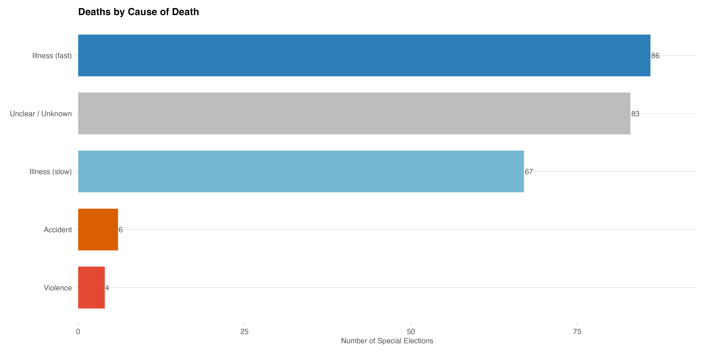{width=90%}

## Data

To test the derived hypotheses, I construct an original dataset that
links special elections to media behavior. The dataset I compile is
structured at the week-by-newspaper-outlet level. The observation period
for special elections begins with the First Congress in 1789 and extends
to the 2020 election. The observation period for the newspaper analysis
is shorter due to data availability and covers the period from 1920 to
2020.

### Special election Data

As the data foundation for special elections, I merge datasets on
members of Congress with datasets on special elections. The primary data
source is the *Biographical Directory of the United States Congress*
(Bioguide). The dataset is structured at the legislator-by-Congress
level and includes information on the beginning and end of
representatives' terms, as well as, in cases where a term ends early,
the reason for that early termination. However, the recorded reason for
the end of a term is fairly coarse and usually contains only information
on whether the individual died or resigned. In addition, the dataset
includes a biographical text with further information on each
legislator. One challenge in the data is that the beginning of the term
does not necessarily correspond to the time at which legislators were
sworn in.

I combine the individual congressional data with data on special
elections. Existing datasets on special elections, such as those by
@hirano2009 , cover only a fraction of the full observation
period. The only comprehensive dataset on special elections that extends
back to the First Congress is available on Wikipedia [@2026]. Although the data
quality of Wikipedia may reasonably be questioned, I justify its use in
this project because no better source exists for the full period. I
validate these data using information from the notes contained in
Bioguide.

Figure 2 displays the number of special elections by decade. Special elections are not uniformly distributed over time; their frequency reflects historical and institutional variation, including changes in mortality, resignation patterns, political career incentives, and state-specific rules for filling House vacancies. Because the timing of replacement elections is regulated by state law, I expect regional variation.

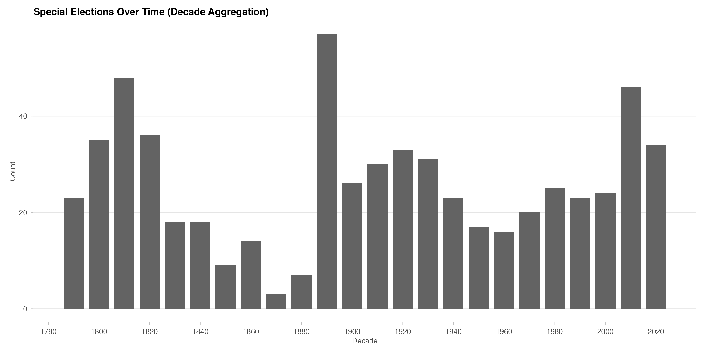{width=90%}

Information on causes of death also comes from Wikipedia [@2026a]. Wikipedia in
turn lists *Memorial Addresses* from HathiTrust as the primary source.
Again, I use the Bioguide information available to me to verify the
recorded causes of death. I then classify causes of death by means of
keyword matching into the categories illness (fast), illness (slow),
accident, violence, and unclear/unknown. In later analyses, I
distinguish between these different forms of death to ensure robustness and exogeneity.

I merge these datasets into a joint special election dataset that
records, for each special election, who left Congress and who was
elected as a replacement, including the relevant biographical
information, the reason the special election occurred, and, if the
original member of Congress died, the cause of death.

Figure 3 shows the distribution of special elections by U.S. region over the full observation period. This figure is confounded by the fact that states entered the Union at different historical moments and are therefore not observed for the same length of time. Earlier-admitted states, particularly in the Northeast and parts of the South, mechanically accumulate more special elections than later-admitted states in the West. Figure 4 shows the distribution of causes of death among House members by region. The same confound applies, but importantly, there is no evidence of systematic sorting of causes of death by region, for instance due to regional disease outbreaks or concentrated political violence.

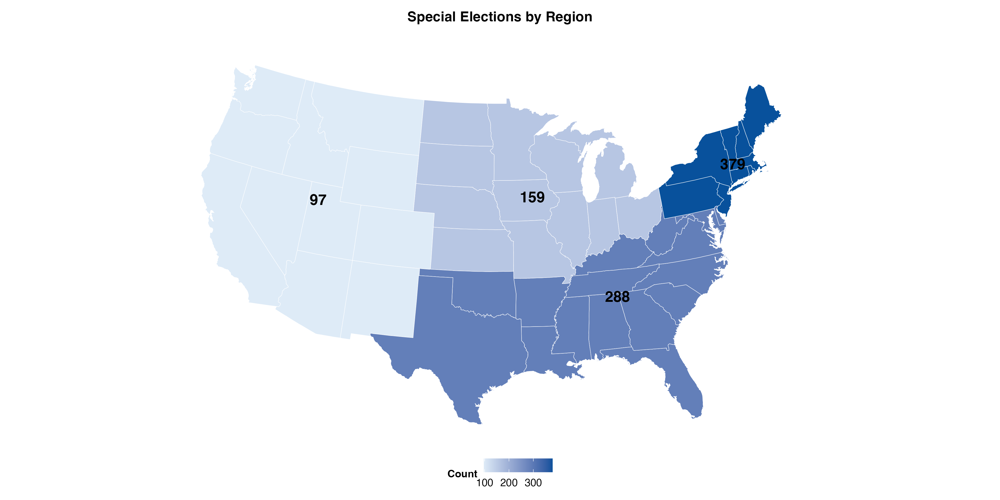{width=75%}

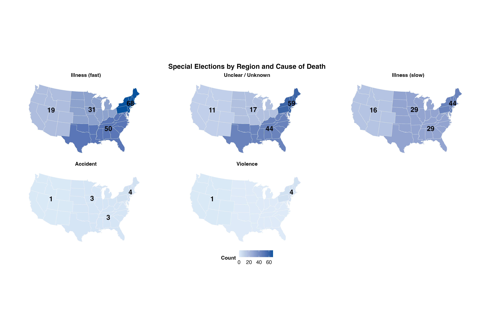{width=90%}

### Newspaper Data

The newspaper data come from ProQuest TDM Studio. TDM Studio provides
access to a large number of newspaper archives, including historical
newspapers collected and curated by ProQuest itself. For my research
design, I consider only U.S. newspaper outlets for which historical
newspaper articles are available. Given computational constraints, while
still aiming to ensure geographic coverage, I select representative
outlets from each region of the United States. I
focus on newspapers with a long tradition in their respective regions
and a reputation for journalistic standards, so that no obvious biases
are introduced into my models.

For the Northeast, I use historical newspaper articles from the *New
York Times*. For the South, I draw on *The Atlanta Constitution* and
*The Baltimore Sun*. For the Midwest, I use historical articles from the
*Chicago Tribune*, and for the West, I use the *Los Angeles Times* and
the *Los Angeles Sentinel*.

To make the number of articles manageable, I restrict the sample to
English-language articles classified as "news" and containing political
keywords such as *Congress*, *election*, or *campaign* in the full text 
(for the full search prompt, see Appendix A).
After filtering, the dataset contains 1,347,370 articles.

To measure partisan tone, I use the large language model Llama 3.2, a 3-billion-parameter open-source model, to classify the partisan slant of each article headline. For each headline, the model is prompted to assign a directional slant score: positive values indicate Republican-leaning coverage, negative values indicate Democratic-leaning coverage, and zero indicates neutral framing. The prompt instructs the model to evaluate whether the headline implicitly favors one party's positions, candidates, or narrative frame over the other's (for the full LLM prompt, see Appendix A).

The resulting headline-level slant scores are then aggregated to the outlet-week level by computing the mean score across all articles published by a given outlet in a given week. This outlet-week mean constitutes the primary outcome variable, *slant*, used in the event-study and difference-in-differences specifications. As a secondary outcome measuring the *total slant* of coverage rather than its direction I use the absolute value of each headline-level score, $|\text{slant}|$, averaged within outlet-weeks. A higher absolute score indicates that articles cluster at one partisan extreme, regardless of direction, and thus captures internal homogeneity of coverage.

This measurement approach has several advantages. First, it scales to the full corpus of 1.3 million articles without requiring manual coding. Second, because the model evaluates headlines rather than full article text, it focuses on the most salient editorial signal visible to readers. Third, aggregating to the outlet-week level smooths idiosyncratic noise in individual headline classifications and aligns with the panel structure of the design. A limitation is that LLM-based classification may introduce systematic errors for historically distant language; I address this by reporting results separately for pre- and post-1970 subsamples.

## Identification Strategy and Threats to Identification

For identification, I employ a stacked difference-in-differences (DiD) design combined with event-study plots to assess dynamic treatment effects [@angrist2008; @roth2023]. The stacked DiD approach constructs a separate clean comparison dataset for each event (i.e., each special election), in which the treated region is matched against all not-yet-treated or never-treated control regions observed in the same event window. These event-specific datasets are then stacked and estimated jointly. This avoids the negative-weighting problem that arises in two-way fixed-effects estimators with heterogeneous treatment timing [@roth2023].

The estimating equation takes the form:

$$Y_{irt} = \sum_{\tau \neq -1} \beta_\tau \cdot \mathbf{1}[\text{EventTime}_{it} = \tau] \times \text{Treated}_{ir} + \delta_i + \gamma_{t} + \varepsilon_{irt},$$

where $Y_{irt}$ is the outcome (partisan slant or article volume) for outlet $i$ in event-specific stack $r$ at relative time $t$. $\text{Treated}_{ir}$ equals one if outlet $i$ is located in the region where event $r$ took place. $\delta_i$ are event fixed effects and $\gamma_t$ are event-time fixed effects, both estimated within each event stack. Standard errors are clustered at the event level to account for within-event correlation across outlets and weeks.

The coefficients $\beta_\tau$ for $\tau < -1$ constitute a pre-trend test: under the parallel-trends assumption, these should be jointly indistinguishable from zero. The post-period coefficients ($\tau \geq 0$) capture the dynamic treatment effect over the campaign window. The pooled average treatment effect on the treated (ATT) is computed as the weighted average of post-period $\beta_\tau$ estimates.

I use the stacked DiD rather than a simple pooled two-way fixed-effects specification for two reasons. First, the stacked design explicitly accounts for the fact that control units may themselves be treated in other event stacks, which would contaminate a naive estimator. Second, restricting each comparison to a well-defined event window of 25 weeks (12 pre-treatment + 1 reference + 12 post-treatment) for the volume analysis (*H1*) and 13 weeks for the tone analysis (*H2* and *H3*) respectively, prevents contamination across temporally overlapping events.

Because I do not observe newspaper circulation directly, the geographic effects can only be proxied. I therefore assign outlets to U.S. regions as the coarsest feasible level of geographic clustering. A region is treated if it is in a vacancy period preceding a special election. The remaining regions in the same time period serve as the control group.

The parallel-trends assumption is plausible given the exogenous nature of the treatment: the timing of a House member's death is not strategically chosen by either the outlet or political actors. During the campaign period, there may be additional influences on the media environment, such as political advertising by parties, candidates, or interest groups [@bode2016], but these are all causally downstream of the vacancy event and therefore form part of the reduced-form effect I seek to estimate.

To assess the robustness of the parallel-trends assumption beyond the visual pre-trend test, I apply the sensitivity analysis of @roth2023 (HonestDiD). This method characterizes the minimum deviation from parallel trends, expressed as a multiple $\bar{M}$ of the largest observed pre-trend, that would be required to overturn the post-period estimates. Results of this analysis for each main specification are presented in the appendix.

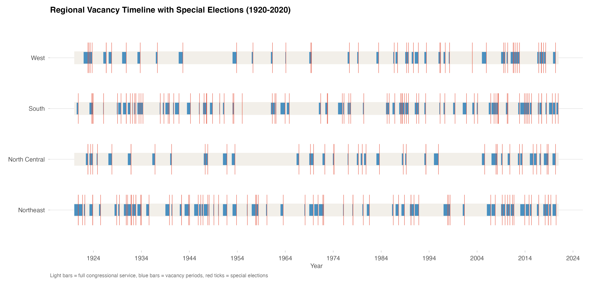{width=90%}

Figure 5 displays vacancy periods and the timing of special elections across regions over the full observation period and is intended to illustrate the research design. Each blue-shaded interval denotes a vacancy period preceding a special election, which is indicated by a red vertical line. In the empirical framework outlined here, this vacancy period defines the treatment period.
The 12 weeks prior to the onset of the vacancy period are used as the pre-treatment window. Regions that are not treated during a given period serve as the control group for both the difference-in-differences specification and the event-study design.

# Results

## Article Volume

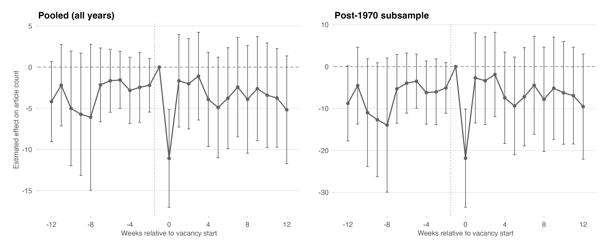{width=90%}

I first examine whether a special election affects the *volume* of political news coverage, that is, the number of articles published per outlet-week (*H1*). If the outlined mechanism holds, I expect to observe an increase in the number of political articles during the campaign period. Figure 7 shows the full event-study trajectories for article volume in the pooled and post-1970 samples. I distinguish between these two samples because the literature identifies the early 1970s as the beginning of a period of rising partisan polarization in American public opinion [@highton2011; @layman2006]. If audience polarization amplifies demand-side pressure on outlets to adopt partisan framing, treatment effects should be larger in the post-1970 period. Pre-period coefficients are flat and jointly insignificant, supporting the parallel-trends assumption. Post-period coefficients are also close to zero and statistically indistinguishable from zero throughout the campaign window. This null result is consistent with the view that special elections shift the partisan framing of coverage without expanding its total volume.

Figure 8 displays the ATT estimates for article volume across the pooled sample, the post-1970 subsample, and the exogenous-deaths subsample. None of the specifications yields a statistically significant effect of the campaign period on article volume. This indicates that, even if the proposed mechanism holds, newspapers do not respond to increased demand for political news by expanding their supply. The exogenous-deaths specification even suggests a negative point estimate, though it too is imprecisely estimated. I therefore fail to find support for *H1* and reject it.

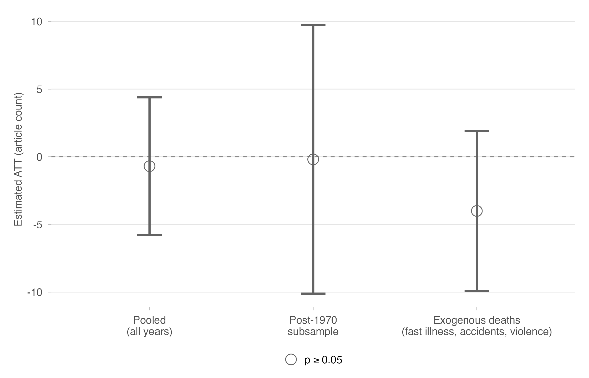{width=75%}

## Partisan Tone

{width=75%}

Having established a null effect on article volume, I turn to partisan tone. Figure 9 shows ATT estimates for headline slant across four specifications: the pooled sample, the post-1970 subsample, the exogenous-deaths subsample (fast illness, accidents, and violence combined), and the illness-slow subsample as a placebo comparison. The first two specifications represent the primary estimates; the exogenous-deaths specification provides the cleanest causal identification by restricting to the most unforeseen causes of vacancy; the illness-slow specification serves as a within-deaths placebo, since slow illnesses may violate the exogeneity assumption due to anticipation effects, so that I cannot rule out endogeneity problems.

All four specifications yield statistically significant effects at the 95% confidence level. The pooled and post-1970 models show an average treatment effect of approximately 0.03 points on the slant scale, where positive values indicate Republican-leaning coverage and negative values indicate Democratic-leaning coverage. The pooled and post-1970 point estimates are nearly identical, providing no evidence of a temporal trend in line with *H3*. A pre-1970 model could not be estimated reliably due to the small number of observations and the absence of stable pre-trends.

The exogenous-deaths specification yields an effect approximately twice as large, which is consistent with the interpretation that non-exogenous vacancies attenuate the average estimated effect, for instance because strategic resignations lack the abrupt competitive shock that drives media polarization. The illness-slow specification, shown in grey, serves as a placebo comparison: because slow illnesses may violate the exogeneity assumption through anticipation effects, the causal interpretation of this estimate is limited. Nevertheless, the large coefficient (approximately 0.09) and the descriptive finding that coverage becomes more partisan when outlets can anticipate the vacancy are consistent with the theoretical mechanism. These results provide strong support for *H2*, while the evidence speaks against *H3*.

Figure 10 presents the full event-study trajectories for the three main slant specifications across the full observation period. Pre-period coefficients are broadly flat, providing visual support for the parallel-trends assumption. The exogenous-deaths specification shows a modest pre-trend in the week immediately preceding the vacancy, which is not unexpected: in cases of sudden fatal illness, media outlets often report on the severity of the condition before the member's death is officially announced. This motivates the donut design reported in the robustness section. Post-period coefficients turn positive at the onset of the campaign window and remain elevated, consistent with a sustained increase in partisan slant during special-election campaigns. The coefficients in the pooled model flatten after a few weeks, which may reflect the diluting influence of non-exogenous vacancies or coincident political events (Formal tests for pre-trends in Appendix B).

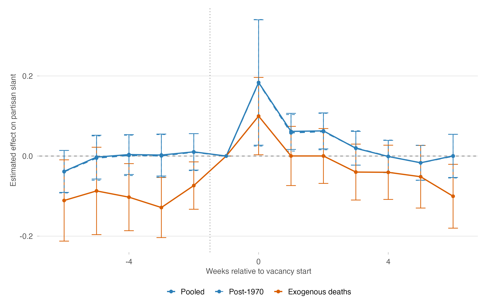{width=85%}

## Internal Pluralism

The following results are exploratory given the data limitations documented in the preceding section. Due to limited outlet coverage in the article-level data, pre-trend tests fail across all specifications, and results should be interpreted descriptively rather than causally.

Figure 11 presents event-study estimates for the article-level slant outcome. To examine whether editorial vacancies affect the directional slant and extremeness of individual articles, I construct an article-level stacked panel in which each article appears once per event that covers its publication week. I estimate two-way fixed effects models with *headline slant* and *absolute headline slant* as outcomes. The preferred specification absorbs outlet-by-event fixed effects (outlet:event FE), which eliminates any outlet-specific baseline that may differ across events and identifies the treatment effect purely from within-outlet, within-event variation over time. As a robustness check, I also estimate a model with additive fixed effects for events, outlets, and time periods separately (additive FE), which is less conservative but assumes outlet-specific baselines are constant across events.

The plot reveals two noteworthy patterns. First, the more conservative outlet-event specification shows clearer and stronger effects, providing additional empirical support for *H2*. Second, the post-1990 models suggest diminishing effects over time, a pattern that runs counter to *H3*. Possible explanations include rising journalistic professionalization or intensified competition from emerging media forms, though the difference across periods is not statistically significant and the result should be treated as exploratory given the data limitations noted above (For another operationalization of interal pluralism see Appendix C).

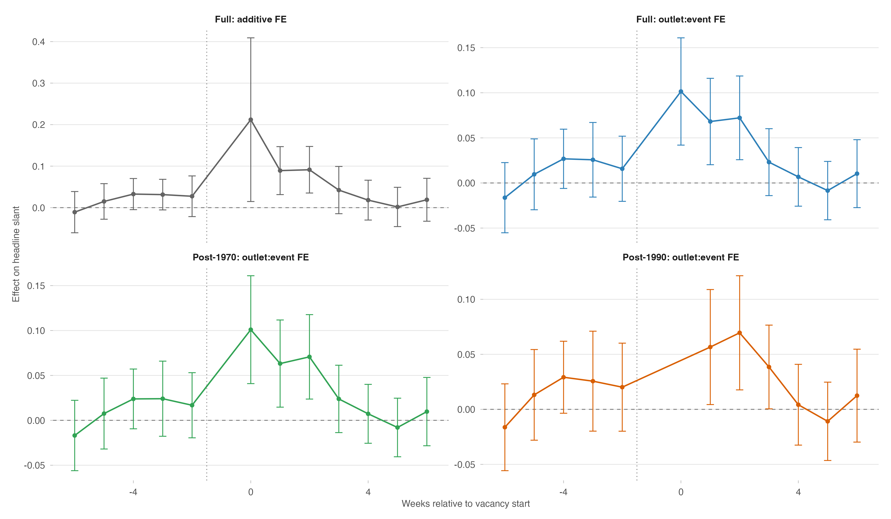{width=90%}

# Robustness


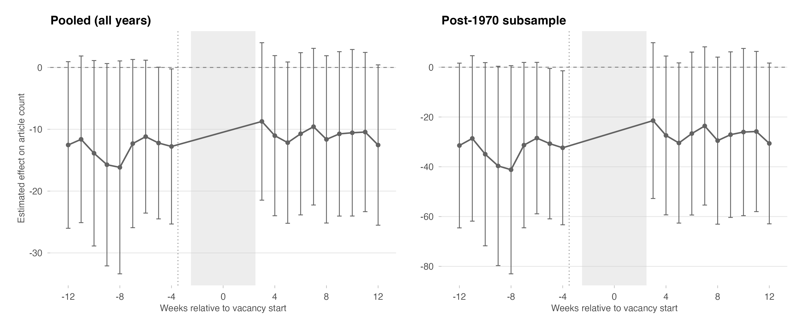{width=90%}

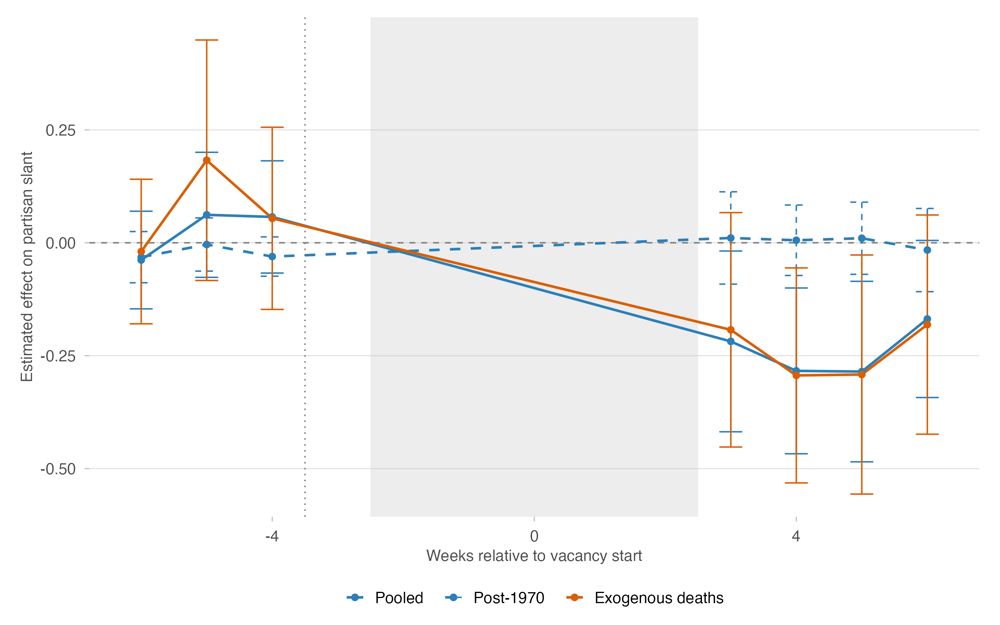{width=90%}

A key concern in event-study designs is that estimated pre-treatment coefficients may partly reflect anticipation effects rather than a stable baseline. In the context of electoral vacancies caused by illness, journalists and editors may begin adjusting coverage already before the formal vacancy is declared, for instance, as a member's health deteriorates and the prospect of a special election becomes foreseeable. To address this concern, I implement a *donut difference-in-differences* design, which removes the five weeks immediately surrounding the treatment window (event time $-2$ through $+2$) and shifts the reference period to $t = -3$. This creates a "donut hole" around the transition period, ensuring that identification relies only on variation from weeks further removed from the vacancy start.

Figures 12 and 13 illustrate the event-study coefficients under this specification. The grey shaded band marks the excluded time period. For article volume, the coefficients in the retained pre-period show no systematic pre-trend, and the post-period estimates cannot be distinguished from zero in any specification. For partisan slant, Figure 13 shows broadly flat pre-trends for the pooled and exogenous-deaths specifications. The post-period coefficients shift below zero, indicating a negative effect that is inconsistent in sign with the main results; the post-1970 subsample is the only specification that yields a precisely estimated null effect.

Figure 14 presents the pooled average treatment effects on the treated (ATT) across all specifications and both outcomes under the donut design. For article volume, the point estimates are negative but imprecisely estimated and not statistically significant at conventional levels. For partisan slant, the pooled and exogenous-deaths specifications retain a negative and statistically significant ATT; the effect sizes are even larger than in the main analysis. The post-1970 estimate is close to zero and insignificant. Taken together, the donut results suggest that the slant effects identified in the main analysis are primarily concentrated in the transition period and are not robust across the full treatment window. This could indicate a violation of the assumption of no co-treatment.

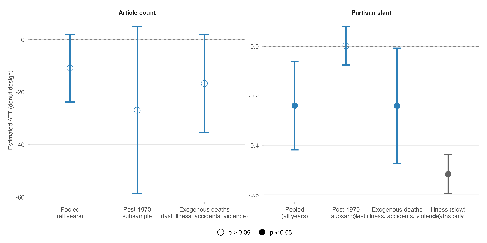{width=90%}

# Discussion

I examined the effect of special election campaigns on the behavior of U.S. print media, constructing an original data set covering all House special elections from 1789 to 2020 and merging it with historical newspaper data. Using stacked difference-in-differences models, I find evidence that special election campaigns increase the partisan slant of headline coverage, though the effect does not appear to be robust to more demanding specifications such as the donut design. Standard theories of political information typically assume that information is generally beneficial for democratic accountability. The results of this study, however, suggest that information in the period leading up to elections may be more partisan than its baseline, with implications for the quality of the information environment available to voters. Whether differential exposure to partisan media environments affects voters’ political attitudes remains an important question for future research.

The results should be interpreted with caution for several reasons. First, I use regions to construct treatment and control groups, but even with this strategy, the stable unit treatment value assumption (SUTVA) is likely violated. Historical newspaper outlets often had readerships extending well beyond their immediate region, and major outlets were not consumed exclusively locally. Spillovers of this kind would most likely bias the estimated coefficients toward zero, so the violation is not necessarily fatal to the design, but it limits the precision of the geographic assignment.

A more serious concern relates to the internal validity of the measurement strategy. The language model I use has relatively few parameters and therefore limited ability to understand context, which may introduce systematic classification errors, especially across long historical periods. In addition, I classify only article headlines rather than full article texts. Headlines may be more sensationalist than the underlying content, and this focus may overstate the degree of partisan framing relative to a full-text measure.
Additionally, election data about the competitiveness of the special election would increase the internal validity of the concept political intensity.

The most serious concern for the internal validity of my findings is the lack of robustness in the donut-difference-in-difference design. 
These results indicate, that the result in the main model might be driven by the death of one house-member and not of the election campaign. Future research should focus on identifying the treatment effect of the death and use a donut-design as main specification.

A further limitation concerns the generalizability of the findings. The small number of newspaper outlets contributes to instability in the estimates. The newspapers in the sample may not be representative of the broader historical media landscape, and a disproportionate share of articles comes from the Chicago Tribune and the New York Times, giving these outlets undue influence over the results.

Moreover the results in this paper are restricted to special elections in the U.S. It remains speculation if the effect would change if for example an incumbent exists or outside of the U.S.

Despite these limitations, the findings are promising for future research. This type of historical media analysis is of substantial substantive relevance, because democratic accountability depends on the quality of information available to voters, and partisan media environments may contribute to both democratic erosion and political polarization.

\newpage

# References
::: {#refs}
:::

\newpage

# Notes

The replication materials for the full paper can be found here: https://github.com/NiklasHaehn/historical_political_economy

# Appendix

## A. Measurement Specifications

### TDM Studio Search

In TDM Studio, I restricted the articles to English-language news articles in which the full content mentions
"congress, senate,  election, campaign,  representative, senator".  Specifically, I am using the following prompt:
*LA(english) AND FULLTEXT(congress OR senate OR election OR campaign OR representative OR senator)*

### LLM Prompt for slant

I used the following prompt:

"
You are a political text annotation assistant.

Task:
Classify the partisan framing of this U.S. newspaper headline.

Return ONE of:
- D  = headline favors Democrats / the liberal side, or criticizes Republicans / the conservative side
- R  = headline favors Republicans / the conservative side, or criticizes Democrats / the liberal side
- N  = neutral or balanced — no clear partisan slant
- NA = not a U.S. political headline, or insufficient context to determine partisan framing

Definitions:
- D: The wording explicitly portrays Democrats, liberals, or the left more favorably, or portrays Republicans, conservatives, or the right more negatively (e.g., loaded praise for Democrats, blame language toward Republicans).
- R: The wording explicitly portrays Republicans, conservatives, or the right more favorably, or portrays Democrats, liberals, or the left more negatively.
- N: Neutral, factual, or symmetric reporting. No evaluative slant toward either side. Includes straightforward reporting of political events, votes, or statements without loaded language.
- NA: The headline is not about U.S. politics, involves no partisan actors, or is too vague or incomplete to classify.

Rules:
1. Use only the headline text. Do not use outside knowledge.
2. Evaluate explicit wording only — do not infer unstated meanings or assume bias from context.
3. Coverage of only one party is NOT automatically partisan. Return D or R only if the wording itself is evaluative or loaded. If coverage is neutral and factual, return N even if only one party is mentioned.
4. If uncertain between D and R, return N.
5. Return only one value: D, R, N, or NA.

Headline: {headline}
"

## B. Robustness: Illness (fast) Subsample

Figure B1 replicates the main slant event study restricting the sample to special elections triggered by fast-onset illnesses only. This is the most conservative exogeneity restriction: these deaths were, by definition, not anticipated by the media environment. The pre-period is flat and the post-period pattern mirrors the main result, providing strong support for the causal interpretation.

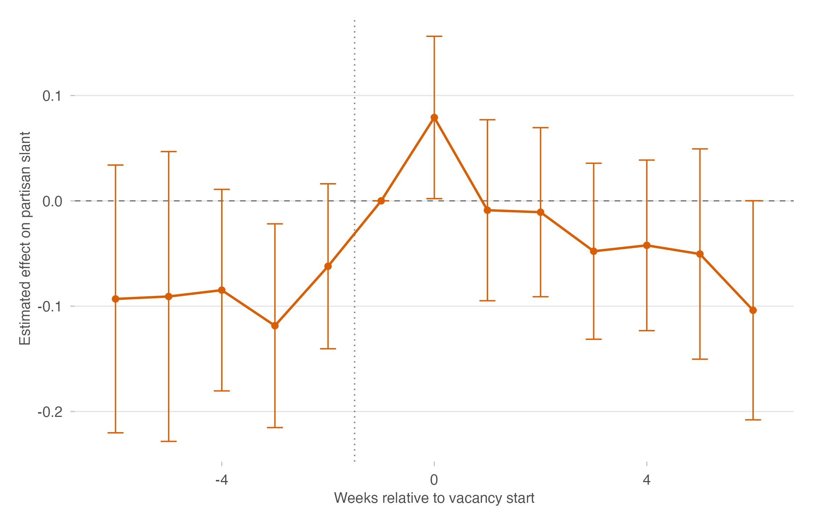{width=80%}

## B. HonestDiD Sensitivity Analysis

Figure B2 presents the @roth2023 sensitivity analysis for each of the four main DiD specifications: pooled, post-1970, exogenous deaths, and illness (slow). The horizontal axis shows $\bar{M}$, the maximum pre-trend violation as a multiple of the largest observed pre-period coefficient. The shaded bands display the robust confidence set under each violation level. A specification is considered robust if the confidence set excludes zero for small values of $\bar{M}$.

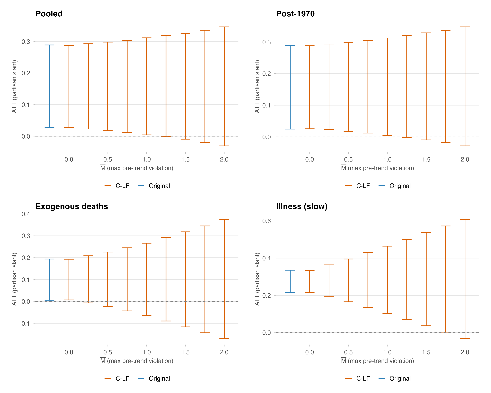{width=90%}

## C. Internal Pluralism: SD of Headline Slant

Figure  C3 shows the event-study estimates for internal pluralism, operationalized as the standard deviation of article-level headline slant within an outlet-week. A higher within-outlet standard deviation indicates more heterogeneous coverage. The figure is presented for two outlets with sufficient article density across the observation period (NYT, Chicago Tribune). Pre-trend tests fail, so these results should be interpreted as descriptive evidence only.

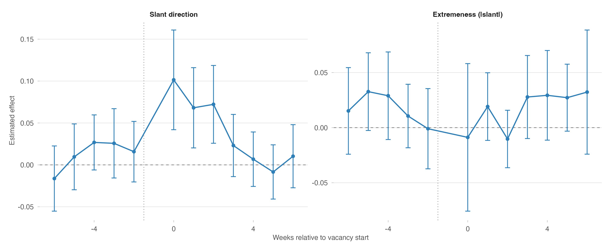{width=90%}
